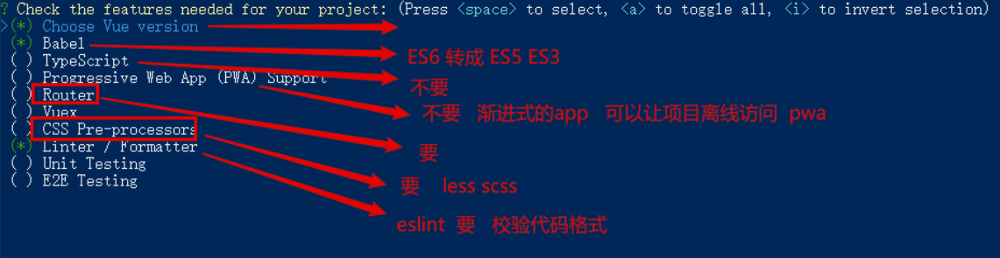
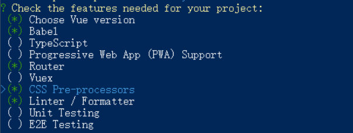

# 项目环境配置

## 初始化项目时手动选择功能

```javascript
? Please pick a preset:
  Default ([Vue 2] babel, eslint)
  Default (Vue 3 Preview) ([Vue 3] babel, eslint)
> Manually select features 
```






## 配置视口

注：如果是移动端项目，需要配置视口，并且禁止用户缩放屏幕

找到`public/index.html` 文件

```html
<meta name="viewport" content="width=device-width,initial-scale=1.0, user-scalable=no">
```


## 项目中rem的配置

> rem布局原理
>
> 1. 使用媒体查询给不同的屏幕的设置设置不同的html的font-size  1rem = 50px
> 2. 把开发使用到的px单位转成rem单位  组件库没法转

### amfe-flexible库

 https://github.com/amfe/lib-flexible 

+ 安装

```
yarn add amfe-flexible
```

+ 在main.js中导入这个库

```js
import 'amfe-flexible'
```

+ 结果：会自动的给页面的html设置font-size

==比较麻烦的事情：我们设计稿量出来的尺寸，我们还需要自己把px转成rem单位==


### postcss介绍 

> less/sass 是css的预处理工具  postcss 是 css的后处理工具

1.[postcss](https://postcss.org/)是一个CSS 的处理工具，本身功能比较单一，它主要负责解析 CSS 代码，再交由插件来进行处理

2.postcss的插件体系非常强大,目前已经有 200多个功能各异的[插件](https://github.com/postcss/postcss/blob/master/docs/plugins.md)，开发人员还可以开发自己的插件。

1. [Autoprefixer](https://github.com/postcss/autoprefixer)插件可以实现自动添加浏览器相关的声明前缀  -webkit -moz
2. [PostCSS Preset ](https://github.com/csstools/postcss-preset-env)[Env](https://github.com/csstools/postcss-preset-env)插件可以让你使用更新的 CSS 语法特性并实现向下兼容
3. [postcss-](https://github.com/cuth/postcss-pxtorem)[pxtorem](https://github.com/cuth/postcss-pxtorem)可以实现将 px 转换为 rem

3.PostCSS 一般不单独使用，而是与已有的构建工具进行集成。

4.Vue CLI 默认集成了 PostCSS并且默认开启了autoprefixer插件

### postcss-pxtorem

+ 安装依赖包

```js
yarn add postcss-pxtorem@5.1.1 -D
```

+ 提供postcss的配置文件`postcss.config.js`

```js
module.exports = {
  plugins: {
    'postcss-pxtorem': {
      // 1rem的大小  750
      rootValue: 37.5,
      propList: ['*']
    }
  }
}
```


## 引入文件时通过@配置绝对路径

在引入文件时，如果文件层级嵌套比较深，通过  **../**  的方式查找文件比较麻烦，可以配置通过@查找文件

在项目根目录下添加  **jsconfig.json**  配置文件

```json
{
  "compilerOptions": {
    "baseUrl": ".",
    "paths": {
      "@/*": ["./src/*"]
    }
  },
  "exclude": ["node_modules", "dist"]
}
```

